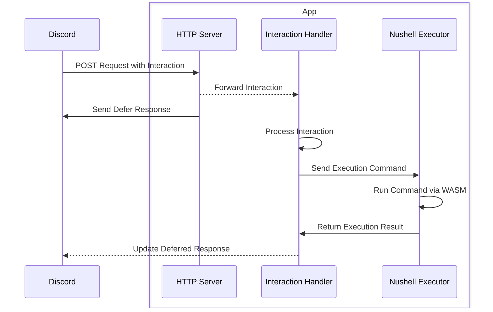

```mermaid
sequenceDiagram
    participant Discord
    box App
        participant HTTP Server
        participant Interaction Handler
        participant Nushell Executor
    end

    Discord->>HTTP Server: POST Request with Interaction
    HTTP Server-->>Interaction Handler: Forward Interaction
    HTTP Server->>Discord: Send Defer Response

    Interaction Handler->>Interaction Handler: Process Interaction 
    Interaction Handler->>Nushell Executor: Send Execution Command
    Nushell Executor->>Nushell Executor: Run Command via WASM
    Nushell Executor->>Interaction Handler: Return Execution Result
    Interaction Handler-->>Discord: Update Deferred Response

```

theme from https://terminalcolors.com/themes/ayu/